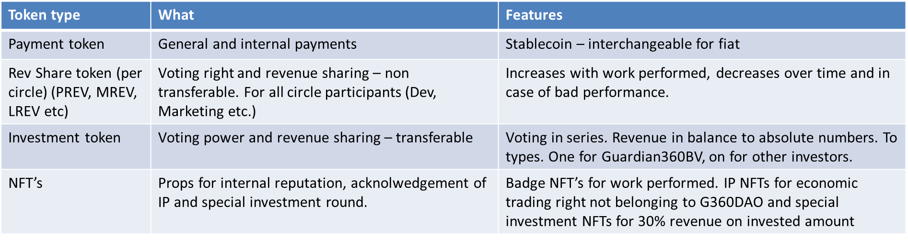

# Bucket Decision Model

As stated, G360DAO works with a unique bucket decision model for strategic voting. Per actor group, a bucket is created, so at the start of the DAO, there will be 5 buckets.

Every bucket of actors can have a different amount of voting rights in them. Meaning bucket “A” can have 3 token holders while bucket “B” can contain 100 token holders.

Each bucket represents a certain number of total votes. This means that e.g., Guardian360 B.V. can represent 10% of the total vote in the DAO and the Dev Circle for example can represent 22.5% of the total votes in the DAO.

<figure><figcaption>
Example of bucket voting system calculation
</figcaption></figure>

This system is set up in such a way that certain token holders can have a relative higher share in voting power, but at the same time none of the buckets will have an absolute majority in voting power. This means that all strategic decisions require consensus over multiple buckets.

The envisioned buckets at this point in time are:

1. Guardian360 B.V. as founder - representing 20%
2. Dev, SE and QA bucket - representing 25%
3. Circles bucket (representing all the individual, non- DEV, SE and QA) circles, like marketing, legal, etc.) - representing 20%
4. Investors - representing 30%
5. G360DAO community - open for anyone who is interested in G360DAO - representing 5%

As stated, the bucket decision system is only for strategic votes. Voting is done based on the quality and quantity of tokens a person has for their specific bucket or circle.
