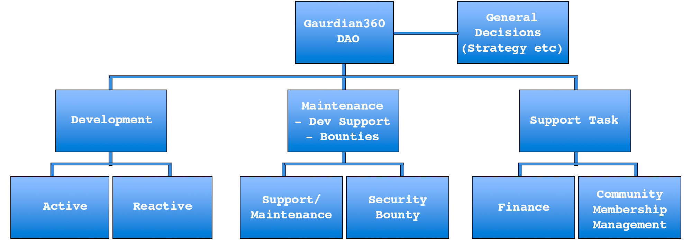

# How We Operate

G360DAO will offer a range of services with their own respective functions that will be shaped by internal processes. The workflow structure of G360DAO is illustrated as follows:

<figure><figcaption>
<em>G360DAO Workflow</em>
</figcaption></figure>

The DAO will have 2 primary processes and various secondary or support processes.  The primary processes are:

1. **Development of information security insights.** This will be done in 2 ways: **active**, where information security insights will be developed by the community commissioned by G360DAO or **reactive**, where people can offer their self-developed information security insight application and present it to G360DAO in order to be included in the portfolio of solutions offered by G360DAO.
2. **Maintenance, dev support and bounty hunting on existing software.** Maintenance and support on existing information security insight applications will be partly incentivised through the long-term incentive system (see incentives). In other words, people who developed the original information security insight application will get a longer-term revenue share incentive, where in return it is expected that the information security insight application is maintained. Maintenance could also be performed by new developers, who will be rewarded for their contributions accordingly.

The primary processes will be performed by the dev circle (See [Main Actors and Team](main-actors-and-team.md))

The secondary processes or support task are various tasks like finance, legal, marketing, community management etc. Each of these tasks will predominately be performed by the specific and dedicated circle. (See Main Actors and Team)
